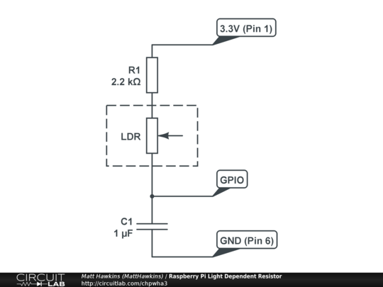
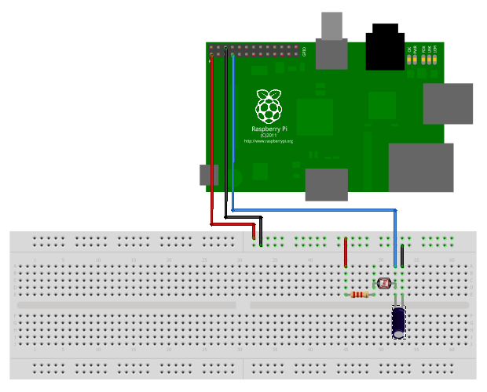

# rpi-monitor-meter

## Configuration

copy monitor_meter.example.conf to monitor_meter.conf and edit.

## Scripts

monitor_meter_test.rb

You should run this script first, to test that the light detection circuit is working.  It continuously samples the light levels as detected by the LDR and prints results to the screen.  Smaller numbers mean more light is being detected (it takes less time for the capacitor to charge).

monitor_meter_control.rb

Daemon control script using the ruby *daemons* gem.  Run monitor_meter_control.rb start to start the script.

monitor_meter.rb

This is the monitoring script run by the above daemon script.
Monitoring data is stored in a sqlite database.

monitor_meter_upload.rb

This script uploads data from the database to pvoutput.org. It should be run periodically from cron.

## Images

## See also

the code and circuit were inspired by this very helpful page:
http://www.raspberrypi-spy.co.uk/2012/08/reading-analogue-sensors-with-one-gpio-pin/
